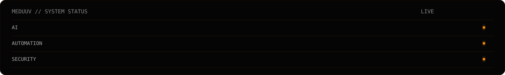

<div align="center">



<br/>


<a href="https://guns.lol/meduu"></a>
<a href="https://github.com/meduuv?tab=repositories"></a>
<a href="https://discord.com/users/1499746728251887650"></a>

</div>


## ABOUT

I am an independent **AI professional and developer** focused on turning ideas into practical, working systems.

My work sits across **artificial intelligence, automation, cybersecurity, developer tooling and infrastructure**. My public portfolio contains focused utilities and experiments, while larger systems are developed privately.

```yaml
name: Medu
handle: meduuv
role: AI Professional / Developer
focus: [AI, Automation, Cybersecurity, Tooling, Infrastructure, Open Source]
principles: [Practicality, Automation, Security, Clarity, Iteration]
```



## CORE AREAS

<table width="100%"><tr>
<td width="25%" valign="top"><h3>AI</h3>LLM applications, agents, RAG, evaluation, prompt systems, model tooling and local AI experimentation.</td>
<td width="25%" valign="top"><h3>AUTOMATION</h3>Bots, integrations, workflows, system automation and repetitive-task elimination.</td>
<td width="25%" valign="top"><h3>SECURITY</h3>Defensive analysis, auditing, monitoring, configuration checks and security automation.</td>
<td width="25%" valign="top"><h3>TOOLING</h3>Python utilities, CLI applications, networking tools, web tooling, testing and release utilities.</td>
</tr></table>


## PRIVATE SYSTEMS

Some of my largest projects are intentionally private and are not part of the public source portfolio.

### APEIRON
**Private · Active Development**

A Discord platform focused on security, automation, moderation, economy and infrastructure.

### NIX
**Private · Active Development**

A personal AI and automation system exploring intelligent workflows, computer control, tools, plugins and system interaction.

> Private projects are referenced only at a high level. Source code and implementation details remain private.

## PUBLIC REPOSITORY INDEX

A categorized index of the newer public repositories in this portfolio.

<details><summary><b>SECURITY & CYBERSECURITY</b></summary>

`threatlens` · `vulnscope` · `auditforge` · `secwatch` · `payloadlab` · `attackmap` · `risklens` · `malwarelens` · `iocvault` · `cvewatch` · `securitylint` · `privcheck` · `accessaudit` · `authscope` · `headerguard` · `integritywatch` · `audittrail` · `sandboxkit` · `defensekit` · `exposuremap`

</details>

<details><summary><b>PYTHON & DEVELOPER UTILITIES</b></summary>

`pyforge` · `pyvault` · `pyinspect` · `pytoolkit` · `pyconvert` · `pyutils` · `pyparse` · `pyformat` · `pycheck` · `pybench` · `pyprofile` · `pydiff` · `pyscan` · `pyextract` · `pystruct` · `pydataset` · `pymonitor` · `pyconfig` · `pyvalidate` · `pyreport`

</details>

<details><summary><b>NETWORKING</b></summary>

`packetlens` · `netprobe` · `netlens` · `nettrace` · `netpulse` · `netstatx` · `netscope` · `netdiag` · `netroute` · `netresolver` · `netlookup` · `netmetrics` · `netmap` · `netcapture` · `netinspect` · `netcheck` · `netping` · `netflow` · `netwatcher` · `netmonitor` · `socketlens` · `dnswatch` · `dnsprobe` · `trafficlens` · `endpointmap` · `netwatch` · `termnet` · `sockscope` · `ipintel`

</details>

<details><summary><b>DNS / HTTP / WEB RECON</b></summary>

`dnsforge` · `subscope` · `httptrace` · `weblens` · `webprobe` · `webforge` · `webscopex` · `sitecheck` · `siteprobe` · `siteaudit` · `webaudit` · `webtrace` · `webmetrics` · `urlforge` · `urlscope` · `urlcheck` · `linkprobe` · `linkscope` · `pagecheck` · `pageprobe` · `webheaders` · `webstatus` · `restscope` · `apiwatch` · `apiprobe` · `apilens` · `webvalidator` · `urlprobe`

</details>

<details><summary><b>DEVOPS & INFRASTRUCTURE</b></summary>

`deployforge` · `deploycheck` · `serverwatch` · `opsforge` · `opswatch` · `infralens` · `infraudit` · `configops` · `buildwatch` · `releasekit` · `releasewatch` · `pipelinekit` · `pipelinecheck` · `containerlens` · `containercheck` · `dockerscope` · `servicewatch` · `healthprobe` · `uptimekit` · `logwatcher`

</details>

<details><summary><b>AI / LLM</b></summary>

`aiforge` · `ailens` · `aitoolkit` · `aiprocess` · `aiprompt` · `promptforge` · `promptscope` · `promptkit` · `modelwatch` · `modelscope` · `modelprobe` · `modelcheck` · `tokenlens` · `tokenwatch` · `contextkit` · `contextlens` · `embeddingkit` · `ragforge` · `ragkit` · `aieval` · `evalforge` · `datasetforge` · `aitrace` · `aiguard` · `localaiutils`

</details>

<details><summary><b>CLI / TERMINAL / SYSTEM</b></summary>

`cliforge` · `clilens` · `cliutils` · `clikit` · `termforge` · `termtools` · `termkit` · `termwatch` · `termlens` · `shellforge` · `shelltools` · `cmdscope` · `cmdkit` · `textforge` · `textscope` · `filecli` · `dirtool` · `findkit` · `grepkit` · `taskcli` · `statuscli` · `systemcli` · `datacli` · `toolboxx` · `termui`

</details>

<details><summary><b>CODE / TESTING / RELEASE ENGINEERING</b></summary>

`devforge` · `devscope` · `devkitx` · `codeforge` · `codescope` · `codetools` · `codecheck` · `codeaudit` · `codewatch` · `buildkitx` · `debugforge` · `debugscope` · `debugkit` · `testforge` · `testscope` · `testkit` · `projectlens` · `projectkit` · `releasetool` · `versionkit` · `dependencylens` · `dependencywatch` · `manifestkit` · `schemacheck` · `devmetrics`

</details>

<details><summary><b>STANDALONE TOOLING</b></summary>

`logforge` · `secretscan` · `filewatch` · `reqforge` · `jsonscope` · `envcheck` · `cronwatch` · `sysprobe` · `apiguard` · `certwatch` · `configlint` · `processmap` · `datainspect` · `shellcheckr` · `cipherbox` · `calc`

</details>

<div align="center"><b><a href="https://github.com/meduuv?tab=repositories">VIEW ALL PUBLIC REPOSITORIES →</a></b></div>


## AI DEVELOPMENT

```text
LLMs → Applications → Agents → Tool use → RAG → Evaluation → Local models
```

I focus on using AI as part of a larger workflow rather than treating an API call as the entire application.

## AUTOMATION

```text
MANUAL → UNDERSTAND → DESIGN → AUTOMATE → MONITOR → IMPROVE
```

## CERTIFICATIONS

**Certified AI Professional**

Additional AI certifications and training across modern AI platforms and technologies, including **Claude** and other AI ecosystems.

## SECURITY

My public security work is intentionally defensive and focused on **visibility, analysis, auditing and repeatable workflows**.

```text
COLLECT → NORMALIZE → ANALYZE → IDENTIFY → REPORT → REMEDIATE
```


## OPEN SOURCE

```text
AI / LLM             Agents · RAG · Evaluation · Model tooling
Security             Auditing · Monitoring · Defensive analysis
Networking           DNS · HTTP · Diagnostics · Visibility
Developer tooling    Python · CLI · Testing · Code utilities
Infrastructure       Deployment · Health · Operations
Web tooling          HTTP · APIs · URLs · Validation
Automation           Workflows · Integrations · Utilities
Visualization        Interactive browser experiences
```

## PROJECT EVOLUTION

<div align="center">`ZEUS`  →  `KNIGHT`  →  `APEIRON`<br/><sub>iteration → experience → stronger systems</sub></div>

## BUILD LOOP

<div align="center">`IDEA` → `DESIGN` → `BUILD` → `TEST` → `SECURE` → `DOCUMENT` → `SHIP` → `ITERATE`</div>


## GITHUB ACTIVITY

<div align="center">

<br/><br/>
<a href="https://github.com/meduuv?tab=repositories"></a>
<a href="https://github.com/meduuv?tab=followers"></a>
<br/><br/>


<br/><br/>

</div>


## TECH STACK

<div align="center">

### LANGUAGES


### AI / DATA


### WEB / BACKEND


### DATABASES / CLOUD


### DEVOPS / SYSTEMS


### PLATFORMS / TOOLING


<br/>

`PYTHON` · `JAVASCRIPT` · `TYPESCRIPT` · `JAVA` · `C/C++` · `HTML` · `CSS` · `BASH` · `LINUX` · `DOCKER` · `GIT` · `AI / LLM` · `AUTOMATION` · `SECURITY`

</div>

## CURRENT FOCUS

<div align="center">

| AI | AUTOMATION | SECURITY | OPEN SOURCE | PRIVATE R&D |
|:---:|:---:|:---:|:---:|:---:|
| Intelligent workflows | Reliable systems | Defensive tooling | Reusable utilities | Larger systems |
| Agents & evaluation | Bots & integrations | Visibility & analysis | Developer tools | Intentional privacy |

</div>


## CONNECT

<div align="center">
<a href="https://guns.lol/meduu"></a>
<a href="https://github.com/meduuv"></a>
<a href="https://discord.com/users/1499746728251887650"></a>
<br/><br/>

<br/><br/>


### BUILD · AUTOMATE · SECURE · IMPROVE

</div>
