<div align="center">



<br/>

<a href="https://guns.lol/meduu"></a>
<a href="https://discord.com/users/1499746728251887650"></a>
<a href="https://github.com/meduuv"></a>

<br/><br/>

<a href="https://git.io/typing-svg">
  
</a>

</div>


<div align="center">

## ABOUT ME

</div>

<table align="center">
<tr>
<td width="50%" valign="top">

```yaml
identity:
  name: "Medu"
  handle: "meduuv"
  role: "Discord Bot Developer"
  focus:
    - Cyber Security Enthusiast
    - Python Developer
    - Batch Developer
    - JavaScript Developer
    - Git User
    - Builder of random tools

specialties:
  - Automation
  - CLI Development
  - Backend Development
  - Discord Infrastructure & Security
```

</td>
<td width="50%" valign="top">

```
I build Discord bots, security-focused
automation systems, and developer tooling
under the MEDU-TOOLS brand.

Most of my work revolves around backend
architecture, CLI utilities, and hardening
Discord servers against nukes, raids, and
abuse — shipped as production-ready,
single-file, dependency-light software.

Currently deep in Apeiron development.
```

</td>
</tr>
</table>


<div align="center">

## TERMINAL

<table>
<tr><td>

```bash
meduuv@core:~$ whoami

Discord Bot Developer

meduuv@core:~$ skills

Python
Batch
JavaScript
Cyber Security
Git
Automation
CLI
Backend

meduuv@core:~$ install

pip install crab-shell

meduuv@core:~$ _
```

</td></tr>
</table>

</div>


<div align="center">

## TECH STACK


</div>


<div align="center">

## GITHUB STATS


<br/>


<br/><br/>


</div>


<div align="center">

## PROJECTS

</div>

<table align="center" width="100%">
<tr>
<td width="100%">

### Founder

<table>
<tr>
<td width="100%">

**MVD**
Founding project and organization — the origin point for Medu's broader tooling and bot ecosystem.

</td>
</tr>
</table>

</td>
</tr>
</table>

<table align="center" width="100%">
<tr>
<td width="100%">

### Head Developer

</td>
</tr>
</table>

<table align="center" width="100%">
<tr>
<td width="50%" valign="top">

**Zeus**
Large-scale production Discord bot with economy, moderation, and gambling systems across multiple cogs.

</td>
<td width="50%" valign="top">

**Knight**
Security-hardened Discord bot with AntiNuke, AntiRaid, and AntiSpam modules backed by PostgreSQL and Redis.

</td>
</tr>
<tr>
<td width="50%" valign="top">

**Apeiron**
Flagship Discord security bot — 23 toggleable protection modules, autosharding, and automated raid recovery.

</td>
<td width="50%" valign="top">

**MeduTools**
Collection of published developer utilities, including static analysis and dead code removal tooling.

</td>
</tr>
<tr>
<td width="50%" valign="top">

**CrabWare**
Toolchain and ecosystem surrounding the CRAB line of command-line utilities.

</td>
<td width="50%" valign="top">

**CrabSH**
Published Python CLI shell — APEIRON CRAB — with subcommand completion and system utilities.

</td>
</tr>
<tr>
<td width="50%" valign="top">

**CrabMulti**
Multi-instance extension of the Crab tooling line for parallel and batched operations.

</td>
<td width="50%" valign="top">

&nbsp;

</td>
</tr>
</table>

<table align="center" width="100%">
<tr>
<td width="100%">

### Assistant Developer

</td>
</tr>
</table>

<table align="center" width="100%">
<tr>
<td width="100%">

**Raeware**
Contributing developer on the Raeware project.

</td>
</tr>
</table>


<div align="center">

## CONNECT

<a href="https://guns.lol/meduu"></a>
<a href="https://discord.com/users/1499746728251887650"></a>
<a href="https://github.com/meduuv"></a>

<br/><br/>


</div>


